##### README
# アプリケーション名
My Library(仮)

---
# アプリケーション概要
- 読書好きのための個人図書館アプリケーションです。読書が好きな人は「これまでに読んだ本が全て揃っている図書館が欲しい」と一度は夢見たことがあるはず。その夢をこのアプリケーションで叶えます！
- これまでに読んだ本（登録した本）の一覧を作ることができます。
- 次に読みたい本や気になっている本をまとめておくこともできます。
- 完全会員制アプリケーションです。
- フレンド機能はありますが、次に読みたい本を探すことを目的としているため、交流機能（コメントやチャットなど）はありません。  
---
# デプロイ
## デプロイしたアプリケーションのURL
--
## テスト用アカウント
- Basic認証ID :admin
- Basic認証パスワード :37292
- メールアドレス :test1@google.com
- パスワード :test137292  
---
# 利用方法
## ユーザー登録
1. トップページのヘッダーからユーザー新規登録を行う
## 本を登録する
1. トップページのヘッダーからログインする
1. トップページの「追加」ボタンから内容（画像、題名、著者名、出版社名、カテゴリ、ひとこと、おすすめ度）を入力して本を登録する
## フレンド機能
1. トップページのフレンドタブからフレンドページに遷移するとフレンド一覧が表示される
---
# アプリケーションを作成した背景
読書が好きな人は、一度は「自分がこれまでに読んだ本のみが全て揃った図書館が欲しい」と考えたことがあると思います。もちろん私もその一人です。

そこで、読んだ本をリスト化できるアプリケーションを作成しようと考えました。

読書管理や読書記録、読みたい本のリストを作成してくれるアプリは様々なものがありますが、そのどれもがレビュー機能などを備えています。

レビューを見て本を選びたい場合もあるかもしれませんが、本屋や図書館で本を選ぶとき、不特定多数のレビューはありません。また、レビューには「良かった」という意見もたくさんありますが、「良くない」という意見ももちろんあります。例えば、自分の好きな本、気に入っている本に対してあまり良くない意見が多く見られると悲しくなってしまいます。気になっている、読みたいと思っている本に対するあまり良くない評価を見てしまい、読むのをやめてしまうこともあるかもしれません。その本はもしかしたら自分にとっては面白い本かもしれません。

このような静かな、誰かの評価に左右されない本選びができると良いなと考えました。

# 洗い出した要件
[要件定義書](https://docs.google.com/spreadsheets/d/1g7V6knLUzvTQE9fhoLTtV7SrTTOvjKVG1kGsh7Ea6iQ/edit?usp=sharing)

---
# 実装した機能についての画像やGIFおよびその説明
--

# 実装予定の機能

# データベース設計

# 画面遷移図

---
# 開発環境
- Ruby on Rails ver. 6.0.0
- JavaScript
- Visual Studio Code
- GitHub Desktop/GitHub
- Heroku
# ローカルでの動作方法
--

---
# 工夫したポイント
--